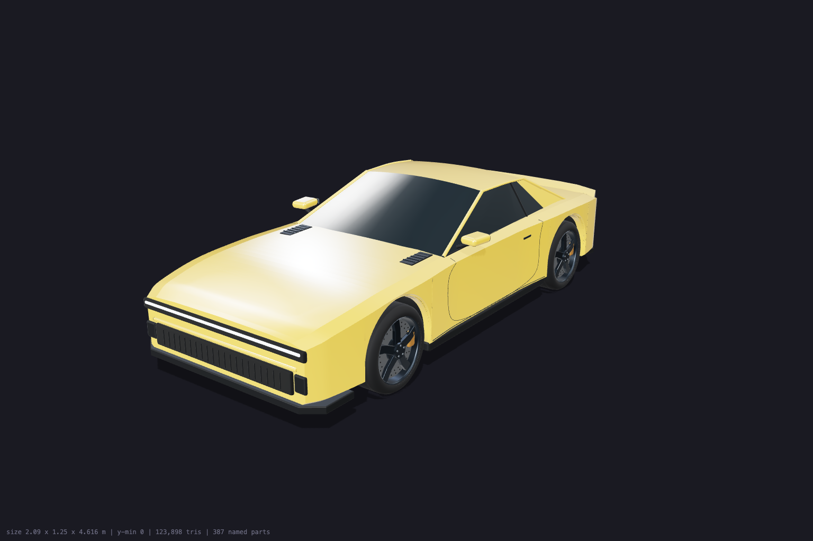
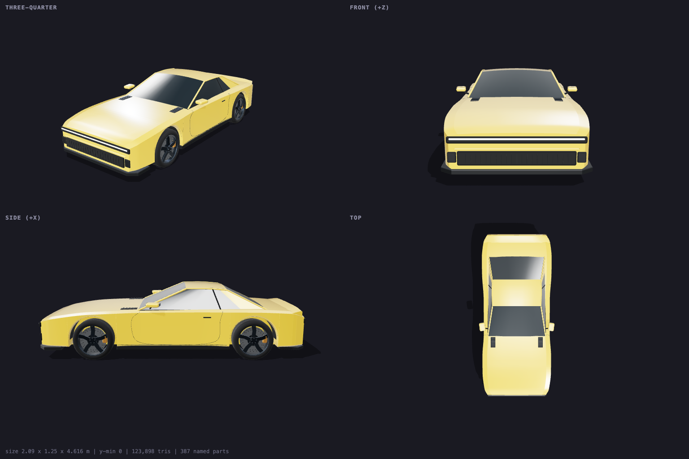
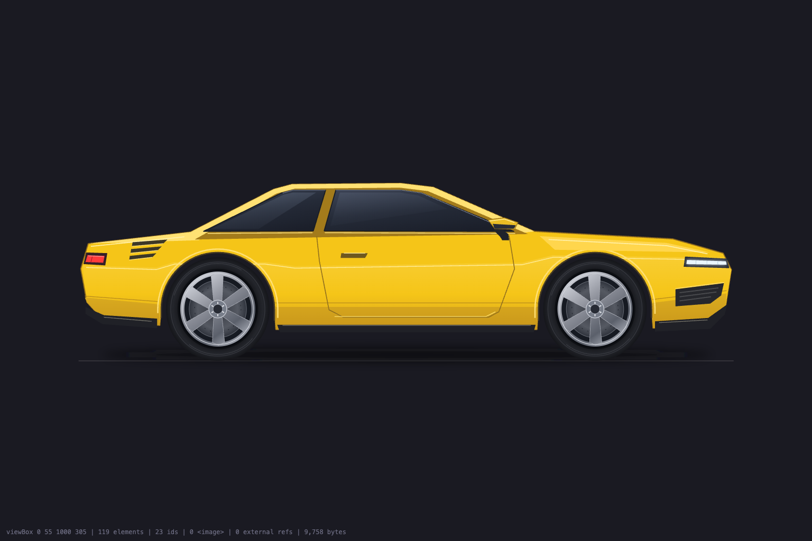
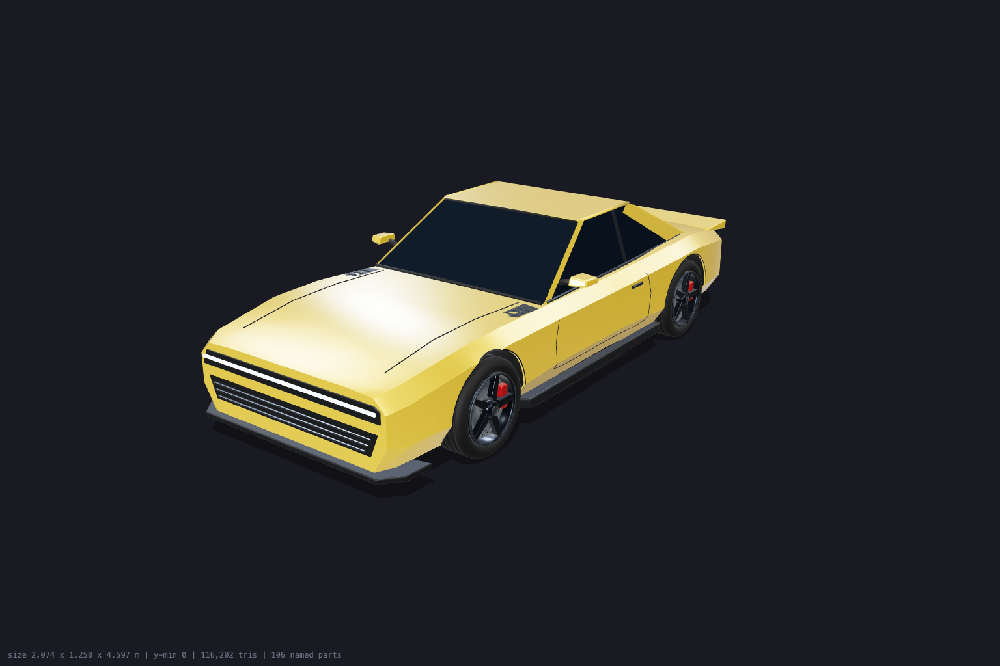
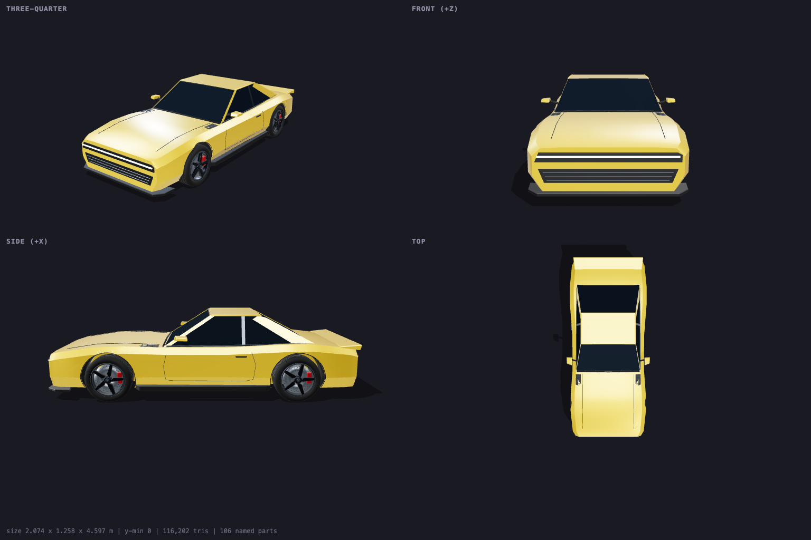

# codex-3d

A Claude Code skill that builds **real 3D objects** (three.js modules, or
GLBs modelled in a real Blender through Blender MCP) and **2D vector
objects** (SVG) by handing the modelling job to GPT-6-Astra through the Codex
CLI, then rendering the result headlessly so Claude can check it before
wiring it into a project.

Claude cannot model. Hand-written three.js comes out as boxes on cylinders.
Astra builds convincing geometry. This skill lets Claude delegate the object,
see a render of it, let Astra fix its own mistakes, and carry on building.

It is the sibling of `codex-image` and the two are disjoint on purpose:
**picture → codex-image, object → codex-3d.** The two descriptions were
validated together at 28/28 on a blind classification set that included
traps such as "photorealistic render of a sneaker" (image) and "a picture
of a 3D-rendered car" (image) next to "car drifting across the intro" (3D).

**Auth:** your existing `codex login`. No API key; usage goes through your
ChatGPT plan.

## Examples

All were built by Astra from the specs in `examples/*/spec.txt` at
`--passes 2 --effort high`; nothing was hand-edited. The first two were
re-rendered afterwards.

**3D car** (`examples/car/object.js`): 4.6 m long, rests on the ground, ten
exposed parts (`wheel_fl` … `steer_fr`, `body`, `headlights`, `taillight`,
`spoiler`), about 9 minutes.





**2D SVG car** (`examples/car-svg/object.svg`): 9 KB, wheels in their own
pivot groups, about 6 minutes.



**Blender car** (`examples/car-blender/`): the same spec with
`--format blender`, then one `--revise` to darken the glass. 4.6 m long,
58,100 triangles, 106 named nodes including the same ten parts, about 12
minutes plus 3 for the revision. These renders are three.js loading the
exported GLB, and both the 1.4 MB `object.glb` and the 2.7 MB `object.blend`
it came from are here.





## Install

From the repo root, `./install.sh` symlinks every skill into
`~/.claude/skills`. To install only this one:

```bash
git clone https://github.com/whoisaldo/claude-codex-skills.git
ln -sfn "$(pwd)/claude-codex-skills/codex-3d" ~/.claude/skills/codex-3d
```

Requires `codex` on `PATH` and logged in (`codex login`), Python 3, Node and
npm (for the contract check; `three` is installed into `vendor/` on first
use), and Google Chrome or Chromium for headless renders. `--format
blender` also needs Blender with the [Blender MCP](https://github.com/ahujasid/mcp-for-blender)
add-on enabled, `mcp-for-blender` on `PATH`, and a logged-in graphical
session (the add-on cannot serve from `blender -b`).

## Use

Claude loads the skill when a task needs an object rather than a picture.
Manually:

```bash
python3 ~/.claude/skills/codex-3d/scripts/codex_3d.py \
  --out public/3d/car \
  --prompt "Object: one low, wide retro-futuristic muscle sports car
Use: hero object on a dark intro; drifts across the screen, wheels spin and steer
Style: stylised realism, continuous surfaces
Materials: body gloss #F5C518 clearcoat; dark tinted glass; matte black trim; emissive lights
Size: 4.6 m long, 1.95 m wide, 1.25 m tall, wheelbase 2.75 m
Parts to expose: wheel_fl, wheel_fr, wheel_rl, wheel_rr, steer_fl, steer_fr, body, headlights, taillight
Constraints: no text, no logos, symmetric, tyres touch y = 0, under 150k triangles"
```

| Flag | Purpose |
|---|---|
| `--out DIR` | Build folder (**required**). Codex is sandboxed to it |
| `--format three\|svg\|blender` | three.js ES module (default), standalone SVG, or `object.glb` + `object.blend` modelled in Blender |
| `--passes N` | 2 (default): build, render, Astra reviews its render and fixes defects |
| `--revise "change"` | Change the existing object; current renders are attached |
| `--render-only` | Re-render after hand edits |
| `--input FILE` | Reference image (repeatable) |
| `--effort` | `high` default; `xhigh` for intricate objects |
| `--blender PATH` | Blender binary for `--format blender` (or `CODEX_3D_BLENDER`); the MCP server command can be set with `CODEX_3D_BLENDER_MCP` |
| `--json` | Machine-readable result with measured bounds, triangles, parts |

Output in `--out`: `object.js` (or `object.svg`, or `object.glb` +
`object.blend`), `preview.png`, `sheet.png` (2x2 contact sheet, 3D only),
`viewer.html` (orbit viewer), `notes.md` (spec + Astra's reports),
`check.mjs`.

## The contract

`object.js` is an ES module against `three@0.186.0`:

```js
import * as THREE from 'three';
export function createObject() { /* ... */ return group; }   // THREE.Group, rests on y = 0, centred, faces +Z
export function updateObject(group, t, dt) { /* optional idle animation */ }
export const meta = { name, size: [w, h, d], parts: [...] };
// group.userData.parts = { wheel_fl: mesh, ... }  named, animatable parts
```

Real-world metres, no textures, no external files, no lights or cameras
(the consumer lights it). `check.mjs` enforces the contract and the
triangle budget; Astra runs it before finishing.

`object.svg` is a standalone SVG with a `viewBox`, no raster, and a
`<g id="...">` per part placed on its own pivot with `translate()`.

`object.glb` is a binary glTF exported from `object.blend`. In Blender the
object is Z-up, rests on z = 0 and faces -Y, which the export turns into the
same space as `object.js`: Y up, resting on y = 0, facing +Z. Each named
part is a glTF node with its origin on its pivot, found with
`gltf.scene.getObjectByName('wheel_fl')`. Materials are plain Principled
BSDF values, which export to glTF PBR, and there are no textures. The GLB
carries an idle animation as glTF clips. `node check.mjs object.glb` loads
the file the way three.js will and enforces the same bounds and triangle
budget.

## How it works

1. Copies `viewer.html` and `check.mjs` into the build folder, links
   `three` in for the check, and pipes a contract + your spec to
   `codex exec --json -m gpt-6-astra -s workspace-write -C <build-dir>`.
   Codex can only write inside that folder.
2. Serves the folder on a throwaway local port and screenshots
   `viewer.html` with headless Chrome (`preview.png`, `sheet.png`). The
   viewer POSTs a status JSON back (bounds, triangle count, part names, or
   the JavaScript error), so a broken module is reported, not guessed at.
   Headless Chrome never exits on a display-less Mac, so the script polls
   for a complete PNG and kills the process group itself.
3. Resumes the same Codex thread with the renders attached and asks Astra
   to fix what it can see, then renders again.

`--format blender` changes only step 1. The script starts a throwaway GUI
Blender with the MCP add-on listening on a free port, and adds `-c`
overrides to `codex exec` that disable every MCP server in the user's Codex
config and register one server, `codex3d_blender`, bound to that port with
eight pre-approved modelling tools (`approval_policy="never"` rejects MCP
calls otherwise). Astra builds with `execute_blender_code`, checks itself
with `get_viewport_screenshot`, saves `object.blend`, exports `object.glb`,
and runs `node check.mjs object.glb`. Steps 2 and 3 then render the exported
GLB in three.js, so the review catches what did not survive the export. The
Blender instance stays up across the review pass and is killed at the end.

The script never uses a Blender the user already has open. A launcher
named `blender-mcp` may be pinned to such an instance, so the script resolves
`mcp-for-blender` itself and passes it `--port`. The
throwaway scene also carries a marker name that Astra must confirm before it
changes anything. Blender runs outside the Codex sandbox, so these runs turn
on the MCP server's safe mode (`BLENDER_MCP_SAFE_MODE=1`), which limits
Astra's Python to `bpy`, `bmesh`, `mathutils` and pure stdlib imports. The
asset-library tools stay disabled.

Measured on the examples: about 6 minutes for the SVG car, 9 minutes for the
3D car and 12 minutes for the Blender car at `--passes 2`, `--effort high`.
Different objects can run in parallel, Blender builds included, since each
gets its own Blender.

## Layout

```
SKILL.md                    what Claude reads (boundary vs codex-image, workflow)
references/prompting.md     spec recipes, revising, failure fixes
scripts/codex_3d.py         the driver
assets/viewer-three.html    orbit viewer + contact sheet (object.js or object.glb), copied into each build
assets/viewer-svg.html      inline SVG viewer
assets/check.mjs            contract checker
examples/                   verified sample outputs
vendor/                     three@0.186.0 for check.mjs (gitignored, created on first use)
```
