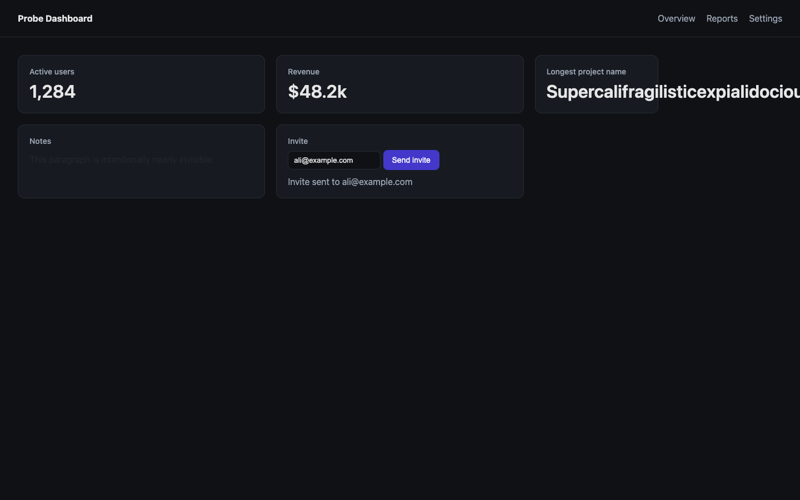
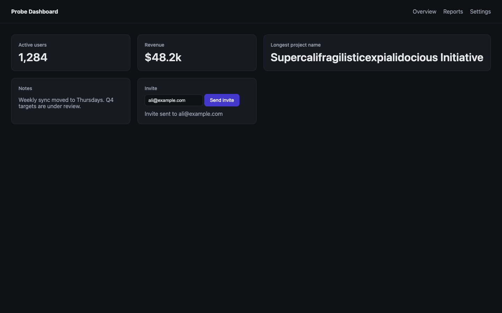
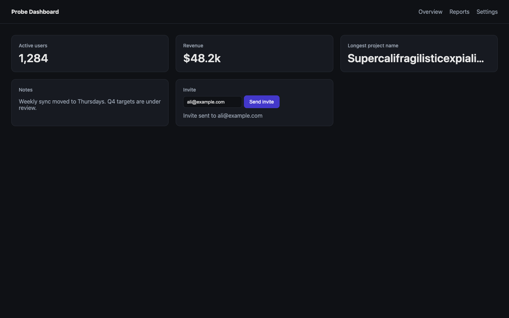

# codex-computer-use

A Claude Code skill that hands a **running web UI** to GPT-6-Astra at max
reasoning, through the Codex CLI. Astra drives the page in a real headless
Chrome, screenshots every state, looks at each screenshot, and returns a
structured report: per-check pass/fail with quoted evidence, defects with a
severity and a likely cause, console errors, and the screenshots.

The split it enables:

> **Claude designs and writes the UI. Astra verifies it and gives visual
> feedback. Claude fixes.**

Astra is the better inspector. It notices clipping, unreadable text and dead
buttons, and it actually exercises the flow instead of assuming it works.

It is the third of the Codex-delegation skills, and the three are disjoint:

| You need | Skill |
|---|---|
| A picture (hero, illustration, mockup) | `codex-image` |
| An object (three.js module, animatable SVG) | `codex-3d` |
| To know whether a running page is right | **`codex-computer-use`** |

**Auth:** your existing `codex login`. No API key; usage goes through your
ChatGPT plan. Max-effort runs are slow (3-10 min), not expensive.

## What it produces: the loop on a real page

[`examples/probe-page/index.html`](examples/probe-page/index.html) is a small
dashboard built with two planted defects (a card whose text overflows, and a
paragraph with almost no contrast) plus an invite form that has to work. What
follows is three real runs at `--effort max`, with Claude fixing the code
between them. Every screenshot and report is in [`examples/`](examples/).

### Run 1: the page as Claude built it. Verdict FAIL, 2 major



The two flow checks passed (header, and the invite status reading exactly
`Invite sent to ali@example.com`). The layout check failed, and Astra
reported, from [`run1-as-built/report.md`](examples/run1-as-built/report.md):

> **[major] Project name overflows its card and the viewport.** The text ends
> at x=1594 while the card ends at x=1185, creating 154px of page overflow.
> Likely cause: `.card.overflow` has `width: 180px`, `white-space: nowrap`
> and `overflow: visible`. Its `.num` text is 32px and measures approximately
> 610px wide.
>
> **[major] Notes paragraph has almost no contrast.** Computed foreground
> #22252b against card background #171a21 yields approximately 1.13:1
> contrast.

168 s, exit code 1.

### Claude fixes it from the report. Run 2: verdict FAIL, 1 major, 1 minor

Claude read the report and changed the CSS: the value gets
`white-space: nowrap; overflow: hidden; text-overflow: ellipsis`, and the
paragraph gets the same readable grey as the other secondary text.



The contrast fix passed. The truncation did not, and Astra explained why,
from [`run2-first-fix/report.md`](examples/run2-first-fix/report.md):

> **[major] Project card expands instead of truncating the name.** Its card
> measures 652.39px wide, while adjacent cards measure approximately
> 341.80px. The text and its container both measure 610.39px, so truncation
> never occurs. Likely cause: `main` uses `grid-template-columns: 1fr 1fr 1fr`,
> while `.card` retains `min-width: auto`. The nowrap value expands the third
> track to its intrinsic width. Setting `.card` to `min-width: 0` or using
> `repeat(3, minmax(0, 1fr))` would allow the existing ellipsis styles to
> take effect.
>
> **[minor] Email placeholder has insufficient contrast.** `#757575` on
> `#0f1115` at 13.33px measures 4.10:1, below the 4.5:1 threshold for normal
> text.

199 s, exit code 1. This is the run that earns its keep: a fix that looked
right in the code was not right on screen, and the report names the CSS
mechanism, the numbers, and two ways to fix it.

### Claude applies Astra's fix. Run 3: verdict PASS

`grid-template-columns: repeat(3, minmax(0, 1fr))` and an explicit
`input::placeholder` colour. [`fix.diff`](examples/fix.diff) is the whole
change across both rounds.



From [`run3-fixed/report.md`](examples/run3-fixed/report.md):

> All five cards are approximately 445.33 px wide, differing by less than
> 0.02 px from browser rounding. Content stays inside card boundaries; page
> scrollWidth equals the 1440 px viewport. The project name visibly ends in
> an ellipsis, with overflow:hidden and text-overflow:ellipsis measured on
> `.card.overflow .num`. The 'email@example.com' placeholder is readable at
> 7.49:1 contrast; secondary card text measures 6.90:1.

172 s, exit code 0, no findings.

## Install

From the repo root, `./install.sh` symlinks every skill into
`~/.claude/skills`. To install only this one:

```bash
git clone https://github.com/whoisaldo/claude-codex-skills.git
ln -sfn "$(pwd)/claude-codex-skills/codex-computer-use" ~/.claude/skills/codex-computer-use
```

Requires:

- `codex` on `PATH`, logged in (`codex login`), with `gpt-6-astra` available
- Python 3
- Node and npm (`agent-browser` is installed into `vendor/` on first use)
- Google Chrome (agent-browser finds it; otherwise
  `vendor/node_modules/.bin/agent-browser install` downloads one)

## Use

Claude loads the skill after it builds UI and needs it checked. Manually:

```bash
python3 ~/.claude/skills/codex-computer-use/scripts/codex_computer_use.py \
  --url http://127.0.0.1:3000/signup \
  --viewport 1440x900 \
  --task "What changed: new sign-up form with inline validation.
Checks:
  1. Empty submit shows 'Enter your email' under the email field, in red.
  2. Fill ali@example.com, click 'Create account', expect the toast 'Check your inbox'.
  3. Nothing clips or overflows; the form is centred.
Pass criteria: both flows work and the layout is clean at this width."
```

| Flag | Purpose |
|---|---|
| `--url URL` | Page to verify (**required**; use `127.0.0.1`, not `0.0.0.0`) |
| `--task` / `--task-file` | The brief (**required**): what changed, checks, pass criteria, ignore |
| `--viewport WxH` | Default `1440x900`; `390x844` for phone |
| `--media dark\|light` | Emulate `prefers-color-scheme` |
| `--reference IMG` | Design reference to compare against (repeatable) |
| `--project DIR` | Source Astra may read for intent (never written) |
| `--effort` | `max` (default); `high` for quick re-checks |
| `--out DIR` | Run directory (default `/tmp/codex-computer-use/<run-id>`) |
| `--timeout` | Seconds, default 1500 |
| `--json` | Machine-readable result on stdout |

**Exit code is the verdict:** `0` pass, `1` fail, `2` blocked (Astra could not
run the checks), `3` error (server down, Chrome, Codex, no report). Runs are
independent; different viewports or pages can run in parallel.

The run directory holds `shots/*.png`, `report.md`, `report.json`,
`prompt.txt` (exactly what Astra was sent) and `last_message.txt`.

## How it works

Codex's native Browser and Computer Use tools exist only in the ChatGPT
desktop app. A headless `codex exec` session gets shell, patching,
`view_image` and text-mode web fetch, nothing more. And Chrome cannot launch
inside Codex's Seatbelt sandbox at all. So:

1. **Pre-flight.** The URL must answer. `agent-browser` is provisioned into
   `vendor/` if missing.
2. **Browser outside the sandbox.** The wrapper starts a headless Chrome
   session with [agent-browser](https://github.com/vercel-labs/agent-browser),
   viewport set, page open, with `AGENT_BROWSER_SOCKET_DIR` pointed at the run
   directory. A sandboxed client can talk to a daemon whose socket is inside
   its writable workspace.
3. **Astra inside the sandbox.** `codex exec --json -s workspace-write -C <run
   dir> -m gpt-6-astra -c model_reasoning_effort="max"` runs with the prompt
   below on stdin, reference images via `-i`, and
   `--output-schema assets/report.schema.json` so the final answer is a JSON
   report rather than prose. Astra drives the page with `snapshot`, `click`,
   `fill`, `screenshot` and looks at every screenshot with `view_image`.
4. **Close and report.** The browser is closed; `report.md` and `report.json`
   are written; the verdict becomes the exit code.

Nothing in the project under test is written by Codex or by the wrapper.

## The prompt Astra receives

This is `assets/prompt.txt`, the template the wrapper fills in and sends to
Codex over stdin (placeholders in braces). The brief you pass becomes the
`BRIEF FROM CLAUDE` block; `examples/prompt-sent.txt` is a filled-in copy.

```text
You are acting as a headless UI verifier: the second pair of eyes on work that
another agent (Claude) has just built. Claude wrote the code. You drive the
real thing in a real browser, look at it, and report what is actually there,
not what the brief says should be there. Be precise, concrete and skeptical.
One real defect Claude could not see is worth more than any praise.

Hard rules:
1. Never create, edit, move or delete files outside the current working
   directory ({run_dir}). Never modify the project under test. You may READ
   its source, if a path is given below, to understand intent.
2. Do not run git, package managers, build tools or servers, and do not kill
   any process.
3. Do not ask follow-up questions. If something is ambiguous, take the most
   reasonable reading and say so in the report.
4. Screenshot discipline: save every screenshot under ./shots/ as
   NN-description.png (01-initial.png, 02-after-submit.png, ...). After saving
   one, LOOK at it with view_image before drawing any conclusion from it.
   Never report on a state you did not look at.
5. Judge only what you can see or measure. If a check cannot be performed,
   mark it blocked and say why instead of guessing.

Browser: a headless Chrome session is already open on the target URL. Drive
it with the CLI at
  {ab}
(use that absolute path, never npx). The session is preselected through the
AGENT_BROWSER_SESSION environment variable, so you do not need --session.
Do not open another session and do not run `close`; the wrapper closes it.

Core commands (run `{ab} skills get core` for the full guide):
  snapshot -i                      interactive elements with @refs (re-run after any navigation or change)
  snapshot                         full accessibility tree
  click @e3 | click "css"          fill <sel> <text>    type <sel> <text>    press Enter    hover <sel>
  select <sel> <value>             check <sel> | uncheck <sel>    scroll down 600    scrollintoview <sel>
  wait <sel> | wait --text "..." | wait 500
  get text|url|title|box|styles <sel>        is visible|enabled|checked <sel>
  screenshot ./shots/NN-name.png             screenshot --full ./shots/NN-name-full.png
  set viewport <w> <h>             set media dark|light
  console                          errors        a11y        eval "<js>"
  back | forward | reload | open <url>

Target URL: {url}
Viewport: {viewport}{media_line}
{context_lines}
=== BRIEF FROM CLAUDE ===
{task}
=== END BRIEF ===

Method:
1. Snapshot the page as it is and take ./shots/01-initial.png. Look at it.
2. Work through the brief's checks in order. For each interaction: act, wait
   for the result, snapshot, screenshot, look. Quote the exact text you see.
3. Then inspect the initial and final states for anything the brief did not
   mention: clipped or overflowing content, unreadable or low-contrast text,
   misalignment or uneven spacing, overlapping elements, broken images,
   placeholder or lorem text, colours that clash with the rest of the page,
   layout that breaks at this viewport. Run `console` and `errors` once and
   report anything there.
4. Severity: blocker = the task cannot be completed or the page is broken;
   major = visibly wrong to a user; minor = polish; nit = taste.
5. Every finding needs evidence: what you did, what you saw (element, ref or
   selector, quoted text), the screenshot that shows it, and, when you can
   tell, the likely cause in CSS or markup terms so Claude can fix it directly.

Finish by replying ONLY with the JSON object required by the output schema.
verdict = "pass" when every check passed and there is no blocker or major
finding; "fail" when any check failed or a blocker/major finding exists;
"blocked" when you could not perform the checks at all.
```

The final answer must match `assets/report.schema.json`: `verdict`
(pass/fail/blocked), `summary`, `checks[]` (check, status, evidence,
screenshot), `findings[]` (severity, title, detail, likely_cause,
screenshot), `console[]`, `screenshots[]`.

## Limits

- Web pages only. Native macOS apps and the desktop are out of scope
  (Codex's native Computer Use is desktop-app only). Electron apps are
  reachable through agent-browser's `electron` skill and a CDP port, by hand.
- Login walls block it; point it at a page that needs no auth or seed a
  session cookie with `agent-browser cookies set` before the run.
- Astra is thorough, not infallible. Look at the screenshots it cites before
  acting on a finding.

## Layout

```
SKILL.md                         what Claude reads: triggering, brief format, workflow
README.md                        this file
scripts/codex_computer_use.py    the wrapper
assets/prompt.txt                the verifier prompt template
assets/report.schema.json        shape of Astra's final answer
references/briefs.md             copy-paste briefs and failure-mode fixes
examples/                        three real runs: screenshots, reports, prompt, the page before and after fixes
vendor/                          agent-browser, installed on first use (gitignored)
```
